# World Bank Indicators Warehouse - Interview Guide

> **Diagram:** see `architecture.svg` in this folder (opens in any browser).

---

## 30-second pitch

"I built a Kimball-style analytical warehouse for World Bank development indicators - 60+ years of data across 200+ countries. A checkpointed Python pipeline ingests the paginated WB REST API into S3 as date-partitioned Parquet, loads to Snowflake, and dbt builds a star schema with grain country �- indicator �- year. The country dimension is SCD Type 2 because countries genuinely change over time - China moved from lower-middle to upper-middle income in 2010, and the snapshot preserves that history. Daily Airflow refresh with backfill across 10+ years, zero-failure dbt test suite."

---

## Architecture walkthrough (2-3 min)

```mermaid
flowchart TD
    A["World Bank REST API\napi.worldbank.org/v2 - paginated per indicator"] -->|"tenacity retries\nindicator-level checkpoint"| B["Python Ingestion\nfetch / checkpoint / writer / logger"]
    B -->|"explicit PyArrow schema"| C["S3 - date-partitioned Parquet\nrun_date=YYYY-MM-DD/indicator=CODE/"]
    C -->|"COPY INTO"| D["Snowflake RAW schema"]
    D --> E["stg_wb_indicators · stg_wb_countries"]
    E --> F["int_indicators_pivoted"]
    F --> G["fct_indicator_values\ngrain: country �- indicator �- year, ~1M+ rows"]
    H["dim_country\nSCD2 via snapshot"] --> G
    I["dim_indicator"] --> G
    D --> J["scd_dim_country snapshot\ntracks income-level reclassifications"]

    subgraph Airflow ["Airflow - daily 06:00 UTC, catchup=True, max_active_runs=1, retries=3"]
        T1[ingest_wb_indicators] --> T2[dbt_run] --> T3[dbt_snapshot] --> T4[dbt_test]
    end
```

**Flow in words:**

1. **Ingest:** `fetch.py` pulls each indicator through the paginated WB API with tenacity-based retries. `checkpoint.py` tracks per-indicator state, so a failure on indicator 7 of 10 resumes there, not from scratch.
2. **Lake:** `writer.py` enforces an explicit PyArrow schema and writes Parquet to S3 partitioned by `run_date` and `indicator`.
3. **Warehouse:** COPY INTO lands data in Snowflake's RAW schema, where dbt source freshness tests watch for stale loads.
4. **Modeling (Kimball):** staging views clean and cast; `int_indicators_pivoted` reshapes the API's response format into fact-ready rows; marts expose `fct_indicator_values` (declared grain: country �- indicator �- year), `dim_country`, and `dim_indicator` with MD5 surrogate keys generated by a reusable dbt macro.
5. **History:** `scd_dim_country` is a dbt snapshot (SCD2) capturing attribute changes like income-group reclassification.
6. **Orchestration:** daily Airflow DAG at 06:00 UTC - `ingest -> dbt_run -> dbt_snapshot -> dbt_test` - with `catchup=True` for historical backfill and email alerting on failure.

---

## Key design decisions (and the "why")

**Why a star schema for this data?**
The questions people ask are dimensional: "GDP per capita for upper-middle-income countries over time," "compare CO2 emissions across regions." A declared fact grain with conformed dimensions makes those queries simple joins + aggregations, and BI tools understand the shape natively.

**Why is the fact grain country �- indicator �- year?**
That's the natural atomic grain of WB data - one measurement per country, per indicator, per year. Declaring grain explicitly (a Kimball discipline) prevents double-counting bugs and makes the uniqueness test meaningful: one row per key, enforced by dbt tests.

**Why SCD2 on dim_country?**
Country attributes change in real life: income classifications get revised, names change. A Type 1 overwrite would silently rewrite history - a 2005 GDP analysis would show China as "upper-middle income" even though that classification only came in 2010. The snapshot keeps both versions with validity windows, enabling correct point-in-time joins.

**Why reprocess the last 2 years on each incremental run?**
The World Bank publishes corrections to recent years throughout the year. Rather than building complex change detection against the API, I treat the last 2 years as a "hot window" that's always re-merged; older years are stable. Simple, and it bounds incremental cost.

**Why daily refresh for annual data?**
The data is annual, but revisions land unpredictably year-round. A daily run is cheap (the hot window keeps it small) and means corrections appear within 24h.

**Why surrogate keys via macro?**
MD5 over the natural key, null-safe, pipe-separated. Centralizing it in a macro guarantees every dimension builds keys identically - and that macro became the seed of my separate dbt utility package.

---

## Questions interviewers ask, with answers

**"Walk me through how a late correction from the World Bank flows through."**
Day N run re-fetches the affected indicator; the new value lands in a fresh `run_date` partition in S3; COPY INTO loads it; the incremental fact model re-merges the last-2-years window, so the corrected value replaces the old one. If a country attribute changed too, the snapshot opens a new SCD2 row.

**"How do you test data quality?"**
Three levels: `not_null` and `relationships` tests on every dimension key in the fact (no orphaned facts), uniqueness on the declared grain, and source freshness tests on RAW so a silently failing ingest gets caught even when dbt models would otherwise run on stale data. The suite runs as a DAG task - zero failures is the deploy gate.

**"Why dbt snapshot instead of a hand-rolled SCD2?"**
For this use case, snapshot's check-strategy is exactly right and is far less code to maintain. I know its limitation - it only builds history forward from first execution - and that's acceptable here since WB exposes current attributes, not attribute history. (In my SCD deep-dive project I implemented manual SCD2 with backfill support for cases where that limitation matters.)

**"How would you add a new indicator?"**
One line: add the WB code to `INDICATOR_CODES` in `.env`. The pipeline is config-driven - fetch, checkpoint, schema, and dbt models all treat the indicator as data, not structure. Backfill via Airflow catchup or a manual `--run-date` loop.

**"What was the hardest part?"**
The WB API's response shape - pagination metadata mixed with data, nulls encoded inconsistently, and indicator metadata needing separate calls. That's why there's a dedicated intermediate model (`int_indicators_pivoted`) isolating the reshaping logic from both staging and marts.

---

## Numbers to remember

- 60+ years, 200+ countries, 10 default indicators, ~1M+ fact rows
- Grain: country �- indicator �- year (declared and tested)
- SCD2 dim_country - real example: China's 2010 income reclassification
- Incremental hot window: last 2 years re-merged per run
- Zero-failure dbt test suite; backfill verified across 10+ years
- DAG: daily 06:00 UTC, retries=3, sequential backfill
